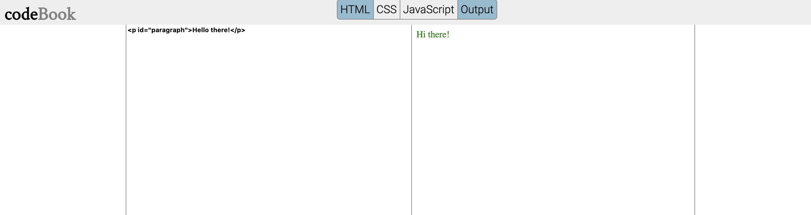

# codeBook
This is a repo for a codeBook platform for coding in html, css, and javascript  
It does not support javascript plugins such jQuery, and others.
   
This image show the main page of the codeBook
  

   
You can navigate the tabs and add the editor for the js or css or even remove the editors as well  

